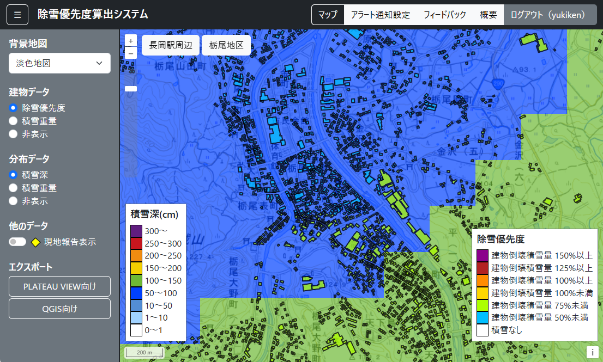

# 除雪優先度算出システム（Web API）

## 更新履歴
| 更新日時 | リリース | 更新内容 |
| ---- | ---- | ---- |
| 2026/3/19 | 1st Release | 初版リリース |

## 1. 概要

本リポジトリでは、Project PLATEAUの令和7年度の建築・都市のDXの推進に向けたユースケース開発業務として実施したUC25-01「豪雪地帯の建築物における除雪優先度算出システム及び被災現場支援ツールの開発」について、その成果物である「除雪優先度算出システム」のソースコードを公開しています。「除雪優先度算出システム」は、PLATEAUの3D都市モデルを活用し、個々の建物の積雪重量や除雪優先度の推定及びブラウザ上での可視化を行うシステムです。

なお、「除雪優先度算出システム」は以下3つのソースコードで構成されており、本リポジトリでは「3. snow-removal_prioritization-system-api」を公開しています。インストールは以下の順序で行います。

1. [snow-removal-prioritization-system](https://github.com/Project-PLATEAU/snow-removal-prioritization-system)\
3D都市モデルを活用し個々の建物の積雪重量や除雪優先度を算出・表示するシステム
2. [snow-removal-prioritization-system-data](https://github.com/Project-PLATEAU/snow-removal-prioritization-system-data)\
除雪優先度算出システムに用いるデータ（気象データ、3D都市モデル等）を収集・算出・作成するシステム
3. [snow-removal-prioritization-system-api](https://github.com/Project-PLATEAU/snow-removal-prioritization-system-api)\
除雪優先度算出システムに用いるデータ（演算データ、フィードバック情報等）を取得・保存するためのAPI

## 2. 「除雪優先度算出システム」について

「豪雪地帯の建築物における除雪優先度算出システム及び被災現場支援ツールの開発」では、豪雪地帯での除雪（屋根の雪下ろし）による事故の削減や除雪作業や作業計画策定の省力化を目的とし、個々の建物の積雪重量や除雪優先度を算出・可視化するシステムを開発しました。本システムは、システムに用いるデータ（気象データ等）の収集、積雪深・積雪重量の分布作成・表示といった気象データから地上の積雪深・積雪重量分布を算出・表示する機能に加え、3D都市モデル（建物の形状及び建築年）を活用し個々の建物の積雪重量・除雪優先度を算出・表示する機能、及び除雪優先度データを基にアラート通知を発信する機能を実装しています。本システムの詳細は[技術検証レポート](https://www.mlit.go.jp/plateau/file/libraries/doc/plateau_tech_doc_0125_ver01.pdf)を参照してください。

## 3. 利用手順

本システムの構築手順及び利用手順については[利用チュートリアル](https://project-plateau.github.io/snow-removal-prioritization-system-api/)を参照してください。

## 4. システム概要

### ① PLATEAU VIEW向けエクスポートデータの取得
- 除雪優先度算出システムで演算された個々の建物の除雪優先度、積雪重量、積雪深を取得します。

### ② QGIS向けエクスポートデータの取得
- 除雪優先度算出システムで演算された個々の建物の積雪重量、除雪優先度を取得します。

### ③ フィードバック情報の送信
- ユーザーからのフィードバックをシステムに送信します。

### ④ アラート通知設定情報の送信
- ユーザーが入力したアラート通知設定をシステムに送信します。

## 5. 利用技術

| 種別 | 名称 | バージョン | 内容 |
| - | - | - | - |
| スクリプト言語 | [PHP](https://www.php.net/) | 8.3.6 | HTMLに埋め込んで動的なWebページを生成するサーバーサイドのスクリプト言語 |
| データベース | [MySQL](https://www.mysql.com/) | 8.0.45 | オープンソースのリレーショナルデータベース管理システム |
| スクリプト言語 | [Python](https://www.python.org/) | 3.12.3 | オープンソースのプログラミング言語 |

## 6. 動作環境
| 項目  | 最小動作環境 | 推奨動作環境 | 
| - | - | - | 
| OS  | Ubuntu 24.04.3 LTS | 同左 | 
| CPUコア数 | 2コア以上 |  4コア以上 | 
| メモリ | 8GB以上 | 16GB以上 | 
| ストレージ | 200GB以上 | 300GB以上 | 

## 7. 本リポジトリのフォルダ構成
| フォルダ名 |　詳細 |
|-|-|
| public | WEB公開ディレクトリー |
| scripts | CZML形式データ作成用スクリプト |
| setup | 本システムをインストールするためのスクリプト及び設定ファイル |
| templates | 各リソースのテンプレート |
| .env.example | 環境設定ファイルのサンプル |
| .htaccess | Webサイトの挙動を制御するための設定ファイル |
| config.php | システム用の設定ファイル |
| composer.json | PHPパッケージ管理ツールComposer用の設定ファイル |

## 8. ライセンス

- ソースコード及び関連ドキュメントの著作権は国土交通省に帰属します。
- 本ドキュメントは[Project PLATEAUのサイトポリシー](https://www.mlit.go.jp/plateau/site-policy/)（CCBY4.0及び政府標準利用規約2.0）に従い提供されています。

## 9. 注意事項

- 本リポジトリは参考資料として提供しているものです。動作保証は行っていません。
- 本リポジトリについては予告なく変更又は削除をする可能性があります。
- 本リポジトリの利用により生じた損失及び損害等について、国土交通省はいかなる責任も負わないものとします。

## 10. 参考資料
- 技術検証レポート: https://www.mlit.go.jp/plateau/file/libraries/doc/plateau_tech_doc_0125_ver01.pdf
- PLATEAU WebサイトのUse caseページ「除雪優先度算出システム」: https://www.mlit.go.jp/plateau/use-case/uc25-01
