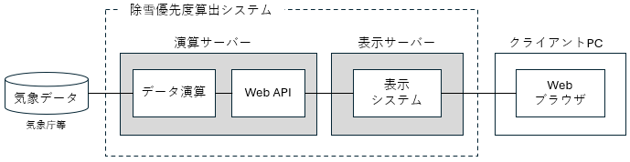

# 環境構築手順書

# 1 本書について

本書では、除雪優先度算出システム（Web API）の利用環境構築手順について記載しています。

> [!NOTE]
> 除雪優先度算出システムは3つのリポジトリに分割して格納しています。インストールは以下の順序で行います。
> * [snow-removal-prioritization-system](https://github.com/Project-PLATEAU/snow-removal-prioritization-system)　（表示システム）
> * [snow-removal-prioritization-system-data](https://github.com/Project-PLATEAU/snow-removal-prioritization-system-data) （データ演算）
> * snow-removal-prioritization-system-api　（Web API、本リポジトリ）



> [!NOTE]
> 本システムは新潟県長岡市中心部及び栃尾区を対象としたものです。

# 2 動作環境

本システムの動作環境は以下のとおりです。

| 項目 | ソフトウェア | バージョン |
| - | - | - |
| OS | Linuxなど、Webサーバーソフトが構築できるOS<br>本書ではUbuntu 24.04を基に説明します | - |
| WEBサーバー | Apache | 2.4.58 |
| スクリプト言語 | PHP | 8.3.6 |
| データベース | MySQL | 8.0.45 |
| バージョン管理 | git | 2.43.0 |
| PHPパッケージ管理 | composer | 2.9.5 |
| スクリプト言語 | Python | 3.12.3 |

# 3 設定手順

## 3-1 前準備

本システムは、データをデータベースに保存する部分があるため、データを格納するデータベースを作成し、本システムから当該データベースへ接続するための認証情報を持つアカウントを作成します。これらの操作は、サーバー側のターミナルから実行します。\
なお、以下のコマンド内の`plateau_user_password`には、任意のパスワードを設定してください。

```shell-session
$ sudo mysql -u root -p
```

```SQL
mysql> CREATE DATABASE plateau;
mysql> CREATE USER 'plateau_user'@'localhost' IDENTIFIED BY 'plateau_user_password';
mysql> GRANT SELECT, INSERT, UPDATE, DELETE, CREATE ON plateau.* TO 'plateau_user'@'localhost';
mysql> EXIT;
```

WEBサーバーのドキュメントルートに本システム用のディレクトリ及びURLで取得できるデータ用のディレクトリを以下のコマンドで作成します。\
`user`の代わりに、OSのユーザー名を設定してください。

```shell-session
$ cd /var/www/html
$ sudo mkdir api
$ sudo mkdir data
$ sudo chown user:user api
$ sudo chown user:user data
```

## 3-2 ソースファイルのダウンロード

本システム用のディレクトリにソースファイルを以下のコマンドでダウンロードし、必要な設定を行います。

```shell-session
$ cd /var/www/html/api
$ git clone --branch main --single-branch https://github.com/Project-PLATEAU/snow-removal-prioritization-system-api.git .
```

以下のコマンドで必要な外部ライブラリ（パッケージ）を一括ダウンロード・インストールします。

```shell-session
$ cd /var/www/html/api
$ composer install
```

## 3-3 環境設定

環境設定ファイル`.env`はセキュリティの理由でリポジトリに含まれていないため、以下のコマンドでサンプル設定ファイル`.env.example`をコピーして環境設定ファイルを作成します。


```shell-session
$ cd /var/www/html/api
$ cp .env.example .env
```

次は、環境設定ファイル`.env`をテキストエディタで開き、データベースのパラメータ、スクリプトのディレクトリ、及び演算システムによって作成されるデータへのパスを設定します。データベースのパラメータは3-1にて設定した値を記入します。

`/var/www/html/api/.env`
```bash
# データベースの設定
DB_NAME=plateau
DB_USER=plateau_user
DB_PASS=plateau_user_password

# PLATEAU VIEW向けデータを作成するスクリプトのディレクトリ
SCRIPT_PATH=/var/www/html/api/scripts

# 演算データのディレクトリ
DATA_DIR=/mnt/disk-demo/sample_data
```

なお、データへのパス`DATA_DIR`は、以下の表に示す方法で設定します。

| 設定値 | 説明 |
| - | - |
| `/mnt/disk-demo/sample_data` | 長岡市、栃尾地区の2026年2月1日0時の1時間分のサンプルデータ<br>（本レポジトリに含まれている） |
| `/mnt/disk-demo/data` | 演算対象のデータ<br>（本レポジトリに含まれていない） |

## 3-4 他の準備

以下のコマンドを実行すると、演算データをURLで取得できるためのセットアップ、及びPython仮想環境のセットアップを行います。

```shell-session
$ cd /var/www/html/api/setup
$ bash data_dir_setup.sh /mnt/disk-demo/sample_data
$ bash python_venv_setup.sh
```

データへのパス`/mnt/disk-demo/sample_data`のパラメータは、上記の表に示した方法で設定します。
